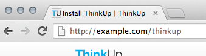
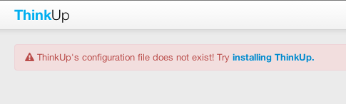
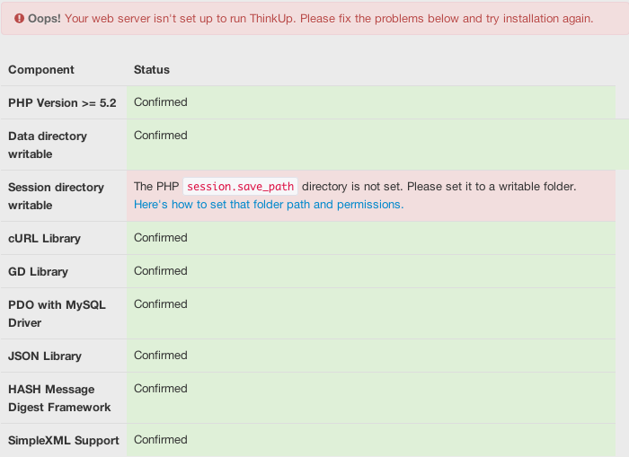
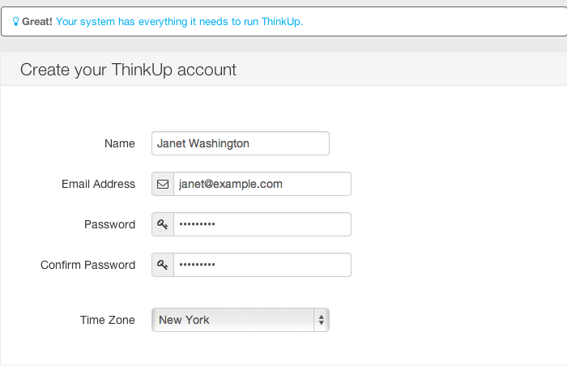
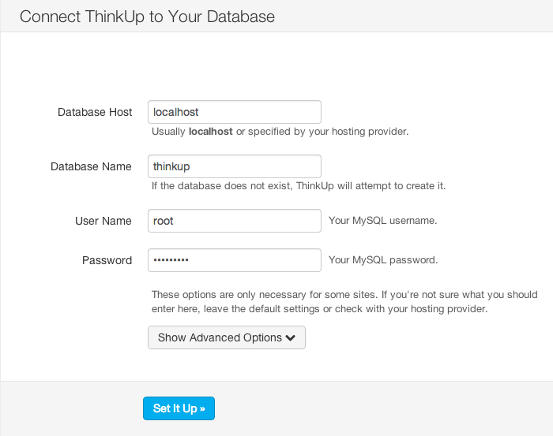
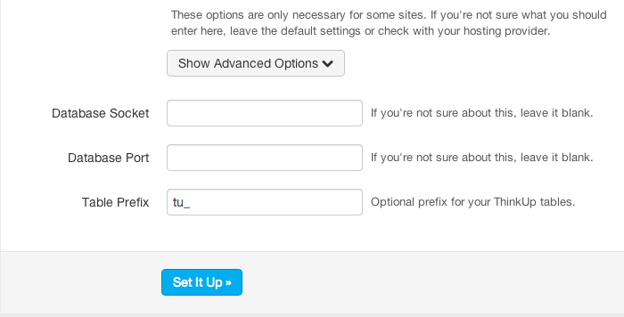

Step-by-Step Installation Guide
===============================

The following is a general tutorial for how to install ThinkUp on
an arbitrary web host. This document assumes some familiarity with
basic web hosting concepts; you may need to refer to your hosting
company's documentation for specifics, or find an
environment-specific tutorial in the `Community Wiki <https://github.com/ginatrapani/ThinkUp/wiki/Installing-ThinkUp>`_.

Prerequisites
-------------

-  File-system access to a web host, preferably over FTP or SFTP.
-  `PHP 5.4 <http://php.net>`_ or higher with the `Client URL (cURL) library
   <http://us3.php.net/manual/en/book.curl.php>`_,
   `GD support <http://www.php.net/manual/en/book.image.php>`_, and the `PDO MySQL driver
   <http://php.net/manual/en/ref.pdo-mysql.php>`_.
   (ThinkUp also requires the following items, which PHP 5.4+ enables by default: the filter, hash, and JSON
   libraries, as well as session support.)
-  `MySQL 5.0.3 <http://mysql.com/>`_ or higher.
-  A publicly available web server. (Twitter authorization requires a public callback URL, so you'll need to expose
   non-public servers to the internet for initial authorization; after that, the server no longer needs to be publicly
   available.)
-  The ability to send email. If your web server cannot send email, you will not be able to activate your ThinkUp
   account, or recover your account should you forget your password.

Download
--------

Download the `latest distribution of ThinkUp <http://thinkup.com/download/>`_.

Extract
-------

Once the download has completed, you should extract the contents using whatever tools your operating system provides.
When completed, you should be left with a folder named "thinkup".

If your operating system does not automatically remove the .zip installation archive, you can delete it at this time.

Upload
------

With the installation extracted, connect to your web host using your usual FTP/SFTP client. Navigate to the root folder
of your website and upload the "thinkup" folder into it.

(There's no requirement to put ThinkUp in the root directory of your website - we just find it easier. If you place it
somewhere else, remember what folder it's in - you'll need to recall this later.)

Recommended: Create Database
----------------------------

At this point, you might want to create a MySQL database for ThinkUp to use. Instructions for how to do this varies
from host to host - many web hosting companies provide a control panel for database management, others may give you
direct access into MySQL. Please contact your web host's support desk if you're unclear on how to do this.

If you're unable to create a new database but already have an existing one, that's okay too! Be sure to pay attention
later, as there's an extra configuration variable you may need to change.

Also, if you have permissions to create a database directly through MySQL, you can skip this step - ThinkUp can create
the database during the install procedure.

Before proceeding to the next step, make sure you have:

-  the address of the MySQL server you have access to, also known
   as the *host*;
-  the name of the database you either just created, are already
   using, or want to use;
-  a username and password that has rights to manipulate this
   database

Launch the Installer
--------------------

You're ready to begin the installation process. If you put the ThinkUp installation in the root document folder of your
web site, then visit the following URL (replacing example.com with the appropriate domain name):

``http://example.com/thinkup/``

If you put ThinkUp into a different folder than the site root, you may need to add additional folders to the URL.

Seeing a Permissions Error Message?
-----------------------------------

At this point, you may see a permissions error message like this one:

If you're not seeing this error, congrats! You can move on to the next step.

If you are, ThinkUp isn't able to write files to a folder within its own installation because your web host doesn't
allow this by default. If you're comfortable working in a terminal session, you can connect via SSH and execute
the recommended commands to resolve the problem.

If you're not that technical, don't worry: this is still easy to fix! Reconnect to your FTP/SFTP session, and find
the ThinkUp folder you uploaded. Select it, and then look for a menu command named something like "Get Info" or
"Manage Permissions". You will likely find a list of "permission bits" you can assign to the folder - just enable
the "World/Write" permission and apply it to the folder. (If your client gives you the option of applying the
permission to the enclosed items, do so.)

Find out more about :doc:`ThinkUp's folder permissions requirements </install/perms>`.

Create The Configuration File
-----------------------------

ThinkUp will now prompt you to create a configuration file. Click the "installing ThinkUp" link to begin.

Requirements Check
------------------

The first screen in the install process is a requirements check, to ensure your environment matches the requirements
listed above. If any of ThinkUp's requirements aren't provided by your system, you'll see a detailed message like the
one above. You will probably need to speak to your web hosting company about resolving these issues by getting
additional PHP modules enabled or making sure your system is configured correctly.

Configuration Details
---------------------

The second screen asks you for some information to help configure ThinkUp.

The opening section creates your administrative account for the system:

-  Type your name into the **Name** field.
-  Type your preferred email address into the **Email Address** field. (Note that you will need to receive an email to
   activate your account, so make sure this is your real address.)
-  Enter your preferred password twice, once in **Password** and again into **Confirm Password**.
-  Select the nearest city to you in **Time Zone**, if it isn't selected already.

The second section is where ThinkUp needs the details about your database:

-  Under **Database Host**, enter the address of the server for your database. This is often "localhost".
-  Under **Database Name**, type the name of the database you'll use for ThinkUp. You may have created this database
   earlier, or you can enter the name of the database you'd like to create (if your database user has permissions to
   create them directly through MySQL).
-  Under **User Name**, type inthe MySQL user name you have been given to access the database.
-  Under **Password**, type the MySQL password you have been given to access the database.

A third section is available, entitled "Advanced Options", which  may be necessary for some hosting environments where
you are given a specific MySQL socket or port that is needed to connect. This section also allows you to set a **table
prefix**, which can be very useful if you're reusing an existing database. Most people can leave this section alone.

Activate Your Account
---------------------

You're in the home stretch! If your :doc:`web server is able to send email </troubleshoot/common/emaildisabled>`,
you will receive an email message with the subject line "Activate Your New ThinkUp Account." (Make sure you check your
spam folder, too.) Click the link found within the email and your account will be activated - and you'll be ready to use
ThinkUp!

You're Done!
------------

Congratulations! (That wasn't so bad, was it?)

At this point you want to get started using ThinkUp - and there's still some more configuration to do -
but for those details, you should visit the :doc:`User Guide </userguide/index>`.

If You Get Stuck
----------------

Installing web software can be tricky. Every host is a little different, and small things can cause large problems.
Luckily, help is here!

-  :doc:`Troubleshooting ThinkUp: Common Problems and Solutions </troubleshoot/common/index>`  contains answers to the
   most common installation issues.
-  Live help is available around the clock from the ThinkUp community on :doc:`IRC </contact>`.
-  Non-live (but still pretty snappy!) help is available on the
   `ThinkUp mailing list <http://groups.google.com/group/thinkupapp>`_.
