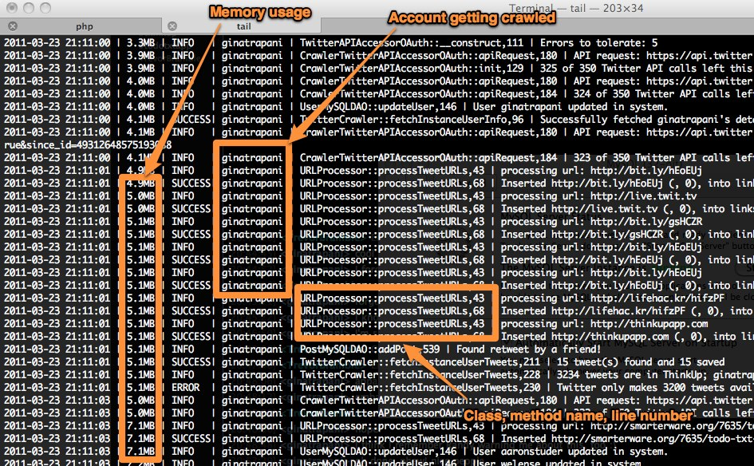

Capture the output of ThinkUp's verbose crawler log
===================================================

To capture the output of ThinkUp's verbose developer log, in the config.inc.php file, set the
``$THINKUP_CFG['log_location']`` value, like this::

 $THINKUP_CFG['log_location']              =
 $THINKUP_CFG['source_root_path'].'logs/crawler.log';

Then, when the crawlwer runs, the crawler.log file will contain the output. To test, SSH into your web server, run the
crawler at the command line and tail -f crawler.log as you go. The output will look something like this (annotated).

Problem: the crawler log / SQL log are not being created
--------------------------------------------------------

At the moment, ThinkUp will not explicitly create the crawler log and SQL log files. They need to be manually created
by you. To do this, execute this command:

``$ touch path/to/log/file.log``

You will need to replace the path with the actual path to where you have set your log files to be in your config. If I
were in my root ThinkUp directory (the one above webapp/) and I wanted to create the log files in log/crawler.log
and log/sql.log, I would execute the following commands from my root ThinkUp directory:

``$ touch log/crawler.log``

``$ touch log/sql.log``

