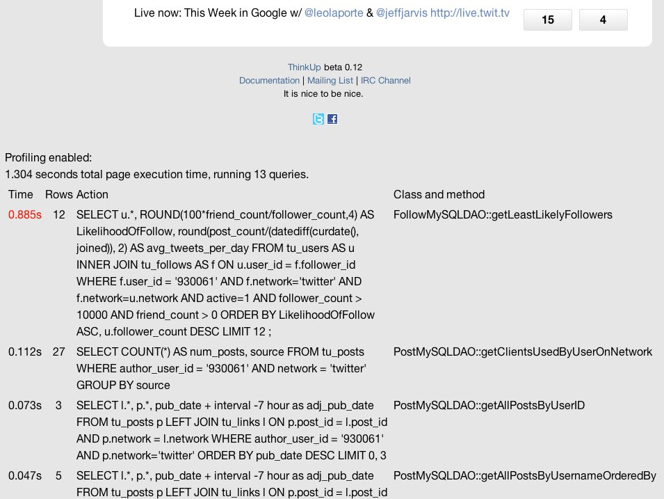

Page Profiler
=============

If your ThinkUp installation's pages are slow to load, you can enable the page profiler to help diagnose the problem.

What the Page Profiler Shows You
--------------------------------

When the page profiler is enabled, at the bottom of every ThinkUp application web page, you'll see how long it took
your web server to generate the page, followed by a list of all the database queries that ran in it
and how many rows they returned, how long each query took to complete, which class and method executed each query, and 
how long the PHP took to generate the page and whether or not it was loaded from cache. The log lists actions slowest to 
fastest (execution time descending).

Here's a screenshot of what the profiler output looks like on the ThinkUp Dashboard:

Particularly slow database queries (those which take 0.5 seconds or more to complete) have their execution time
highlighted in red.

How to Turn on the Page Profiler During Development
---------------------------------------------------

To enable the page profiler on your installation, in ThinkUp's config.inc.php file, set:

``$THINKUP_CFG['enable_profiler']           = true;``

This value is set to false by default.

The page profile is meant for development purposes only.

.. warning::
    Do not enable the page profiler on a ThinkUp installation that's on the public internet. It exposes internal
    ThinkUp queries and parameters, and could pose a security risk.