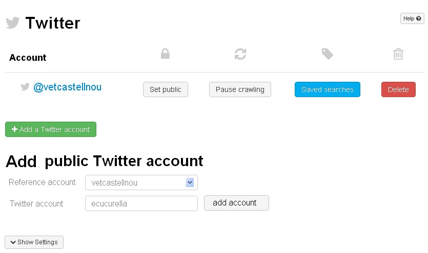

Add a public Twitter account
============================

Twitter lets you get information about other users who are not protecting their tweets.
With Twitter REST API you can get the same information for other like for you except mentions ans retweets.
So, with adding a public Twitter account, you can configure other Twitter accounts to get data.

Set Up the Twitter Plugin (Admin only)
--------------------------------------

To configure the addition of a public Twitter account, you will first need to `create a new application on Twitter for ThinkUp 
<https://dev.twitter.com/apps/new>`_ and then configure **Consumer key** and **Consumer secret**
in Settings > Plugins > Twitter > Configure

Set Up a Twitter account
------------------------

Then you will need to add a Twitter account in Settings > Plugins > Twitter > Configure > Add a Twitter account.

Adding a public Twitter account (Admin only)
--------------------------------------------

Once a Twitter account has been authorized, you can a add a public Twitter account in Settings > Plugins > Twitter 
> Configure > Add a public Twitter account:
* First you need to select an authorized Twitter account
* Second you need to input the username and click **add account** button

If the username is ok the public Twitter account will be added and next time ThinkUp's crawler runs it will execute 
get all information about this account like authorized ones except from mentions and retweets.

Viewing data from public Twitter account
----------------------------------------

You can view data from public Twitter account the same way as an authorized Twitter account

Deleting a public Twitter account (Admin only)
-------------------------------------------------

You can delete a public Twitter account the same way as an authorized Twitter account
